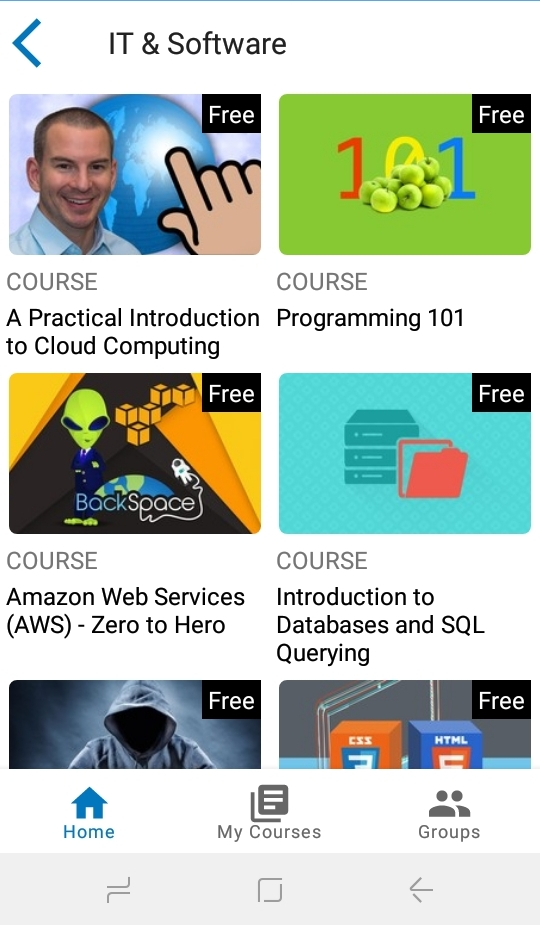

# Xskill

## Summary

This is an android mobile application that uses Udemy affliate API to help users get resources to learn and gain knowledge in various fields. If a user is interested in a certain course, he/she takes the course and can easily track their progress by looking at their saved courses.

This application also provides the users an option to enroll and join into groups creating a collaborative learning environment. However, this feature is under development since it requires a microservice to manage its participants and users and will be updated once complete.

## Screenshots

 

 

